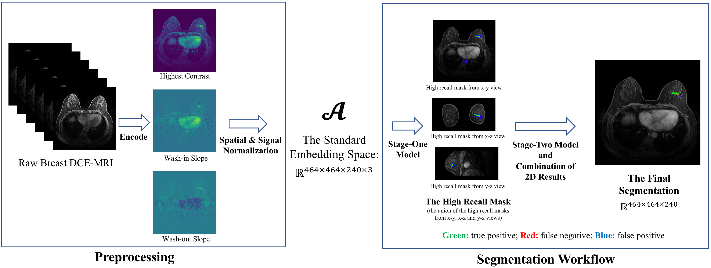

# Multi-Database-DCE-MRI-Breast-Tumor-Seg

## Overview
This repository provides the method described in the paper:
```
Longxi Zhou, et al. "A Workflow for Automatic, Accurate and Robust Breast Tumor Segmentation on Multi-Database DCE-MRI"
```

## Description
The repository gives a novel deep-learning workflow specifically designed for harmonizing intra-dataset variations and inter-datasets biases. The workflow is trained and evaluated on multi-centric datasets. Our workflow includes four components: 1) the machine-agnostic standard embedding space for breast DCE-MRI; 2) the stage-one model that outputs a high recall mask for tumors (average recall >0.99); 3) the stage-two model that refines the high recall mask and outputs the 3D tumor probability map; and 4) the model that calculates adaptive thresholds to get the final segmentation.

### Workflow
<div align="center">
  
</div>

## Run The Trained Models (TODO)
- Step 1): Download the file: "trained_models/" and "example_data/" from [Google Drive](https://drive.google.com/drive/folders/16ZvZfhqMmuF7wqNPKUOntw2P-Mfx5C4l?usp=sharing).
- Step 2): Dowload the source codes from github (note in github, "trained_models/" and "example_data/" are empty files).
- Step 3): Replace the "trained_models/" and "example_data/" with Google Drive downloaded.
- Step 4): Establish the python environment by 'resources/req.txt'.
- Step 5): Open 'interface/dcm_to_enhanced.py', follow the instructions to change global parameters "trained_model_top_dict", "dcm_directory" and "enhance_array_output_directory".
- Step 6): Run 'interface/dcm_to_enhanced.py'.

## Time and Memory Complexity (TODO)
- DLPE method requires GPU ram >= 6 GB and CPU ram >= 24 GB.
- Enhancing one chest CT scan needs about two minutes on one V100 GPU. 

## Contact
If you request our training code for DLPE method, please contact Prof. Xin Gao at xin.gao@kaust.edu.sa.

